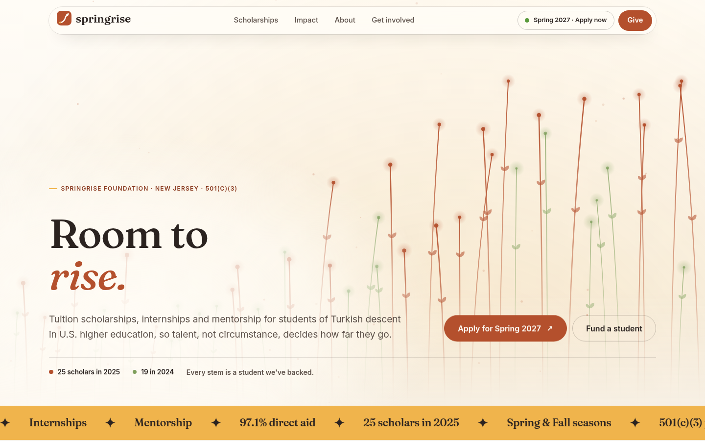

# Springrise Foundation website

The website and scholarship platform for **Springrise Foundation, Inc.**, a New Jersey nonprofit and 501(c)(3) public
charity (EIN 93-2396404). It supports students of Turkish descent in U.S. higher education with scholarships,
internships and mentorship.



## Design: "Rising Field"

- **The signature visual is live data.** The home page hero is a generative canvas with one stem per scholar the
  foundation has supported: 25 clay stems for 2025 and 19 leaf-green stems for 2024. The stems grow in, sway gently
  and lean toward the cursor like plants turning to light. All pointer motion is eased every frame, so nothing snaps.
  Quieter versions of the field open every interior page.
- **The mark** is a growth curve that turns into a leaf, reading as both a chart line and a new shoot.
- **Palette:** warm and hand-made rather than corporate. Paper `#fffcf6` and bone `#f7f1e7` grounds, espresso
  `#2b2320` for dark sections, with clay `#b4502d`, marigold `#f0b44c` and leaf `#7f9f5c` accents.
- **Type:** Fraunces (a soft, warm serif) for headings and Inter for text, on a calm, moderate scale. All fonts are
  self-hosted.
- **Motion and interaction:**
  - headlines revealed word by word, and a purpose statement that lights up as you scroll;
  - pillar cards that lift and warm up on hover;
  - count-up figures, an animated direct-aid ring, and a 100-cent grid showing where each dollar goes;
  - reach dots, fiscal-year bars and an FY2024/FY2025 toggle that re-flows how giving was used;
  - an interactive gift picker, live countdowns to a season's opening or deadline, a by-laws reader with reading
    progress, and a new stem that grows on the application confirmation screen.
- **Accessibility:** all motion respects `prefers-reduced-motion`. Every public page passes an axe WCAG 2 AA audit
  with zero violations.

No photography, logos or visual elements from springrise.org or earlier versions are used.

## Content sources

Every fact lives in `src/lib/facts.ts` and comes from three places:
- **springrise.org:** mission, eligibility, award terms, contact details and ways to give.
- **The foundation's general organization presentation:** FY2024/FY2025 financials, 97.1% direct aid, reach (19 → 25
  students, +31.5%), the three pillars, gift tiers and IRS status.
- **The by-laws:** reproduced in full on `/governance` (linked from the footer) and available as a PDF at
  `/docs/springrise-foundation-bylaws.pdf`.

## Pages

| Path | What it is |
|---|---|
| `/` | Home: live hero field, purpose, pillars, impact dashboard, who we serve, season spotlight, get involved, give |
| `/scholarships` | Current season, season history timeline, eligibility, document checklist, terms, FAQ |
| `/scholarships/<season>` | A season's announcement, application window, countdown and requirements. Signed-in staff can preview drafts |
| `/scholarships/<season>/apply` | Five-chapter application (`?preview=1` to explore it when the season is closed) |
| `/scholarships/status` | Status lookup by reference and email |
| `/impact` | Financial summary, how giving was used, efficiency and reach |
| `/about`, `/get-involved`, `/give`, `/contact` | Organization, roles (mentor, internships, Board, donor), ways to give, contact |
| `/governance` | Legal form, tax status, Board and officers, full by-laws with an article index and PDF |
| `/privacy`, `/unsubscribe`, `/sitemap.xml`, 404 | Supporting pages |
| `/staff` | Staff workspace (password protected) |

## Seasonal scholarships

Staff create a season in `/staff/seasons` with its term, dates in Eastern Time, headline, announcement, and optional
eligibility and requirements. Blank fields fall back to the standard criteria.

- **Draft** seasons are never public.
- **Published** seasons are announced everywhere: the header status pill, the home spotlight countdown, the
  scholarships page and the season page.
- Applications open and close automatically at the set times, and the server enforces this.
- **Archived** seasons stay in the history timeline.
- With email configured, one button sends the announcement to everyone signed up for season alerts. Each message has
  a signed unsubscribe link, and unsubscribing requires a confirmation click.

**The application** has five chapters: You, Your studies, Your people, Documents and Send.
- Answers and PDFs autosave on the applicant's device (localStorage and IndexedDB).
- It includes a tuition calculator and drag-and-drop uploads. Files are checked to be real PDFs.
- Uploads show progress, and resubmitting the same application is safe.
- On submission the applicant gets a reference code, a receipt download and a status lookup.
- The server enforces the season window, allows one application per email per season, and throttles repeated
  attempts.

**The staff workspace** includes:
- an overview of the current season with stage counts, recent applications and inquiries;
- a season editor;
- application review with inline PDFs, stages, award amounts, private notes, an activity timeline and optional
  stage emails;
- inquiries and subscribers;
- CSV exports protected against formula injection.

## Tech

Astro 7 on Cloudflare Workers (server-rendered), with Cloudflare D1 for data and R2 for application PDFs. The
application form is the only Preact component; everything else is HTML and CSS with small scripts.

Security measures:
- CSP and security headers on every response;
- staff sessions stored hashed, in HttpOnly SameSite=Strict cookies;
- parameterized SQL throughout;
- origin checks on form posts;
- `noindex` on `/staff` and `/api`.

## Run locally

```sh
npm install
npm run db:migrate
npm run db:demo                  # local only: opens Spring 2027 so you can apply
echo 'ADMIN_PASSWORD=choose-a-long-local-password' > .dev.vars
npm run dev                      # http://localhost:4321  ·  staff: /staff
```

Tests (with a dev server running):

```sh
BASE_URL=http://localhost:4321 npm run test:api          # API contract, auth, exports, unsubscribe
CHROMIUM_PATH=/path/to/chromium npm run test:e2e         # real-browser application flow
npm run check
```

## Deploy (Cloudflare)

```sh
npx wrangler login
npx wrangler d1 create springrise                  # put the id into wrangler.jsonc
npx wrangler r2 bucket create springrise-applications
npm run db:migrate:remote
npx wrangler secret put ADMIN_PASSWORD              # 16+ characters
npm run deploy
```

Then attach `springrise.org` to the Worker under Workers → springrise → Settings → Domains.

**Optional email** uses the Resend HTTP API:
- set `RESEND_API_KEY` and `SIGNING_SECRET` as secrets;
- optionally set `EMAIL_FROM` and `STAFF_EMAIL`.

Without these, email is skipped and the staff controls say so.

**Before launch:** the database seeds the real season history (Spring 2024 – Fall 2026) and a **Spring 2027 draft
with placeholder dates**. Staff should confirm the real dates and wording, then publish.
