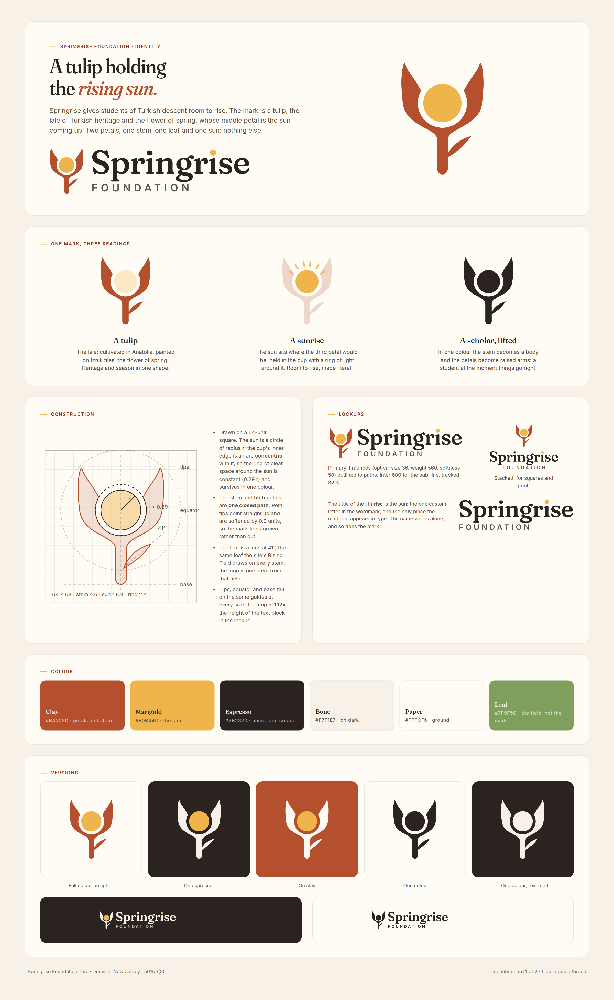
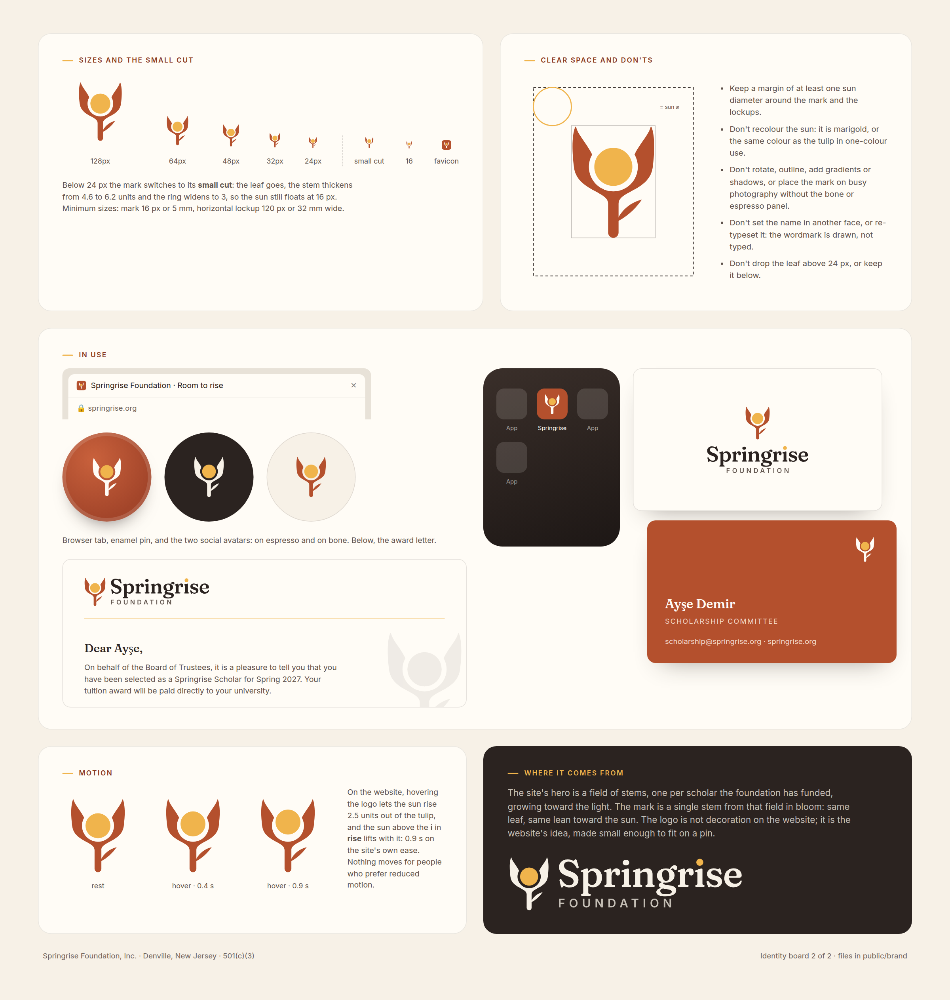

# The Springrise mark

## The idea

Springrise gives students of Turkish descent room to rise. The mark is a **tulip holding the rising sun**: two petals,
one stem, one leaf and one sun, and nothing else. It reads three ways, and all three are the foundation's story.

1. **A tulip.** The lale was cultivated in Anatolia, painted on İznik tiles and gave its name to an Ottoman age of
   learning. It is the flower of Turkish heritage and the flower of spring.
2. **A sunrise.** The sun sits where the tulip's third petal would be, held in the cup with a ring of light around
   it. "Room to rise", the site's headline, made literal.
3. **A scholar, lifted.** In one colour the stem becomes a body and the petals become raised arms: a student at the
   moment things go right.

The mark is also one stem from the site's hero, the Rising Field, where every stem is a scholar the foundation has
funded. Same leaf, same lean toward the light. The logo is the website's idea made small enough to fit on a pin.

## Construction

- Drawn on a 64-unit square. The sun is a circle of radius 8.4 centred at (32, 25.2).
- The cup's inner edge is an arc **concentric with the sun**, so the ring of clear space around it is a constant
  2.4 units (0.29 r). That ring is what keeps the one-colour version readable.
- The stem (4.6 wide) and both petals are **one closed path**. Petal tips point straight up and are rounded by
  0.9 units so the mark feels grown rather than cut.
- The leaf is a lens at 41°, the same leaf the Rising Field draws on its stems.
- **Small cut** (below 24 px): the leaf goes, the stem thickens to 6.2 and the ring widens to 3, so the sun still
  floats at 16 px. The favicon and app icon use this cut on a clay rounded square.

## Wordmark and lockups

- **Springrise** is Fraunces at optical size 36, weight 560, softness 50, tracked −1.2%, outlined to paths.
  The tittle of the **i** in **rise** is the sun: the one custom letter, and the only marigold in type.
- **FOUNDATION** is Inter 600 at 31% of the name size, tracked 32%, aligned to the S.
- In the horizontal lockup the mark stands 1.12× the height of the text block (cap line to sub-line baseline),
  with a gap of 0.26 × the name size. Without the sub-line, 1.34× cap-to-descender.
- The website draws the wordmark from the same paths (`src/components/BrandDefs.astro`), so the header never
  depends on font loading, and on hover the sun rises 2.5 units out of the tulip while the tittle lifts with it.

## Colour

| Name | Hex | Use |
|---|---|---|
| Clay | `#B4502D` | petals and stem on light grounds; the app icon ground |
| Marigold | `#F0B44C` | the sun, always |
| Espresso | `#2B2320` | the name; the one-colour mark |
| Bone | `#F7F1E7` | the mark and name on dark grounds |
| Paper | `#FFFCF6` | preferred light ground; the mark on clay |
| Leaf | `#7F9F5C` | the Rising Field, not the mark |

## Rules

- Keep clear space of at least one sun diameter around the mark and the lockups.
- Minimum sizes: mark 16 px or 5 mm; horizontal lockup 120 px or 32 mm wide.
- Don't recolour the sun. In one-colour use it takes the tulip's colour.
- Don't rotate, outline, add gradients or shadows, or set the mark on busy photography without a bone or
  espresso panel.
- Don't re-typeset the name: the wordmark is drawn, not typed.
- Use the small cut below 24 px and the full mark above it.

## Files

All in `public/brand/`:

| File | What it is |
|---|---|
| `springrise-mark.svg` / `.png` | the mark, clay and marigold |
| `springrise-mark-on-dark.svg` | the mark, bone and marigold |
| `springrise-mark-mono.svg`, `springrise-mark-mono-reverse.svg` | one colour, espresso and bone |
| `springrise-mark-small.svg` | the small cut |
| `springrise-app-icon.svg` / `.png` | clay rounded square with the small cut (also `/favicon.svg`) |
| `springrise-logo.svg` / `.png` | horizontal lockup on light |
| `springrise-logo-on-dark.svg` / `.png` | horizontal lockup for dark grounds (the PNG carries the espresso ground) |
| `springrise-logo-mono.svg` / `.png`, `springrise-logo-mono-reverse.svg` | one-colour lockups |
| `springrise-logo-stacked.svg` / `.png`, `springrise-logo-stacked-on-dark.svg` | stacked lockups |
| `springrise-wordmark.svg` | the name and sub-line alone |

The mark's geometry is parametric (sun radius, ring, stem, petal control points), and every file above, the sprite
in `BrandDefs.astro`, the OG image and these boards were generated from the same source, so they cannot drift apart.
